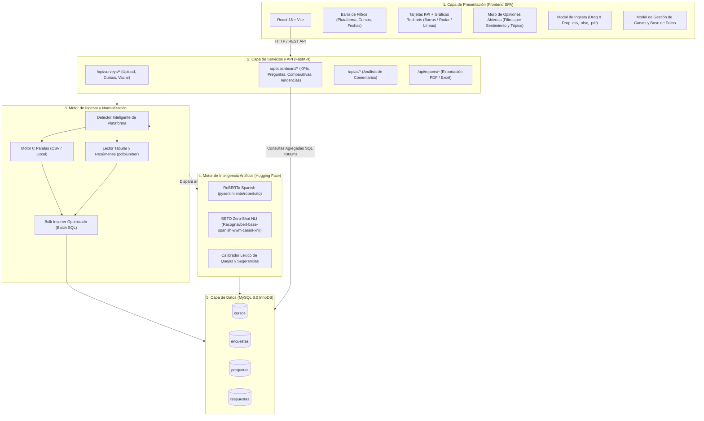

# 📊 Plataforma de Análisis de Encuestas

Sistema integral para la carga, normalización, procesamiento analítico e inferencia de Inteligencia Artificial (Hugging Face) sobre encuestas de satisfacción de **Campus Córdoba** (9 preguntas) y **Campus Virtual Empleados** (5 preguntas).

---

## 🗺️ Arquitectura del Sistema



---

## 📁 Estructura del Código

```text
plataforma-encuesta/
├── docker-compose.yml           # Orquestación de contenedores (Frontend, Backend, MySQL)
├── .env                         # Variables de entorno y configuración
├── README.md                    # Documentación y arquitectura del proyecto
│
├── frontend/                    # Single Page Application (React 18 + Vite)
│   ├── src/
│   │   ├── components/          # Componentes de la interfaz
│   │   │   ├── BarraFiltros.jsx          # Selector de plataforma, cursos y fechas
│   │   │   ├── BarraNavegacion.jsx       # Header, actualización y exportación
│   │   │   ├── TarjetasKpi.jsx           # Indicadores clave (NPS, Satisfacción, Promedio)
│   │   │   ├── GraficosPreguntas.jsx     # Desglose de preguntas (Barras / Radar)
│   │   │   ├── PanelIa.jsx               # Distribución de sentimiento y focos de mejora
│   │   │   ├── ExploradorComentarios.jsx # Muro interactivo de opiniones abiertas
│   │   │   ├── TablaCursos.jsx           # Ranking comparativo por curso y plataforma
│   │   │   ├── GraficoTendencias.jsx     # Evolución temporal mes a mes
│   │   │   ├── ModalCarga.jsx            # Carga drag & drop de CSV, Excel y PDF
│   │   │   └── ModalGestionDatos.jsx     # Gestión y vaciado de cursos/encuestas
│   │   ├── servicios/api.js     # Cliente HTTP con endpoints REST
│   │   ├── App.jsx              # Componente principal y estado global
│   │   └── index.css            # Sistema de estilos y variables CSS
│   └── package.json
│
└── backend/                     # API REST de alto rendimiento (FastAPI + Python 3.12)
    ├── app/
    │   ├── ai/                  # Motor de Inteligencia Artificial (NLP Transformers)
    │   │   ├── analizador.py    # Pipeline RoBERTa + BETO Zero-Shot + Calibrador léxico
    │   │   ├── base.py          # Interfaces y catálogo de tópicos
    │   │   └── servicio.py      # Procesamiento en lote de comentarios pendientes
    │   ├── analytics/           # Motor analítico
    │   │   └── analitica.py     # Consultas SQL agrupadas en una sola pasada (<0.3s)
    │   ├── api/routes/          # Controladores REST
    │   │   ├── tablero.py       # Endpoints para el Dashboard
    │   │   ├── encuestas.py     # Endpoints de ingesta y cursos
    │   │   ├── ia.py            # Endpoints de clasificación con IA
    │   │   └── reportes.py      # Generación de informes PDF y Excel
    │   ├── db/                  # Capa de Base de Datos (SQLAlchemy)
    │   │   ├── models/          # Modelos relacionales: Curso, Encuesta, Pregunta, Respuesta
    │   │   ├── base.py          # Conexión y sesión de base de datos
    │   │   └── iniciar_bd.py    # Migraciones suaves y sembrado de catálogo oficial
    │   ├── ingestion/           # Ingesta masiva y deduplicación
    │   │   ├── normalizador.py  # Detección inteligente de plataforma y normalización
    │   │   ├── lector_pdf.py    # Extracción de los 3 formatos PDF de Moodle
    │   │   └── importador.py    # Inserción masiva de alta velocidad (bulk_insert)
    │   ├── reports/             # Generación de reportes PDF (WeasyPrint)
    │   ├── config.py            # Configuración de entorno con Pydantic Settings
    │   └── main.py              # Punto de entrada de la aplicación FastAPI
    ├── requirements.txt         # Dependencias Python
    └── Dockerfile
```

---

## 🚀 Comandos de Ejecución

Para iniciar la plataforma completa con Docker:
```bash
docker compose up -d --build
```

### URLs Locales:
* **Frontend:** http://localhost:5173
* **Backend API:** http://localhost:8000
* **Documentación Interactiva Swagger:** http://localhost:8000/docs
* **Base de Datos MySQL:** Puerto `3307` (`encuestas_db`)
